\#Task

You have been assigned to a client that wants a penetration test conducted on an environment due to be released to production in seven days. 

***\*Scope of Work\****

The client requests that an engineer conducts an assessment of the provided virtual environment. The client has asked that minimal information be provided about the assessment, wanting the engagement conducted from the eyes of a malicious actor (black box penetration test). The client has asked that you secure two flags (no location provided) as proof of exploitation:

- User.txt
- Root.txt

Additionally, the client has provided the following scope allowances:

- Any tools or techniques are permitted in this engagement, however we ask that you attempt manual exploitation first
- Locate and note all vulnerabilities found
- Submit the flags discovered to the dashboard
- Only the IP address assigned to your machine is in scope
- Find and report ALL vulnerabilities (yes, there is more than one path to root)

(Roleplay off)

I encourage you to approach this challenge as an actual penetration test. Consider writing a report, to include an executive summary, vulnerability and exploitation assessment, and remediation suggestions, as this will benefit you in preparation for the eLearnSecurity Certified Professional Penetration Tester or career as a penetration tester in the field.

Note - Nothing in this room requires Metasploit

Machine may take up to 5 minutes for all services to start.

We are doing a kind of penetration testing here.

\#Enumeration

We start with nmap scanning. A complete scan will be helpful.

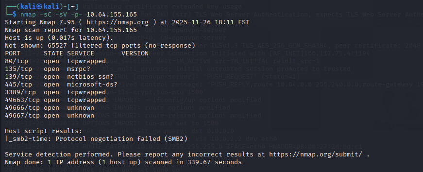

We noticed that port 445, which is smb service, is opened. Smbclient is a good choice for us. 

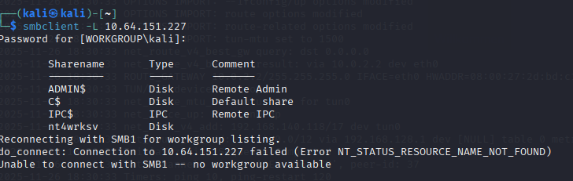

We find several things.

We try to connect to nt4wrksv. Here we find a file named passwords.txt. That could be really useful.

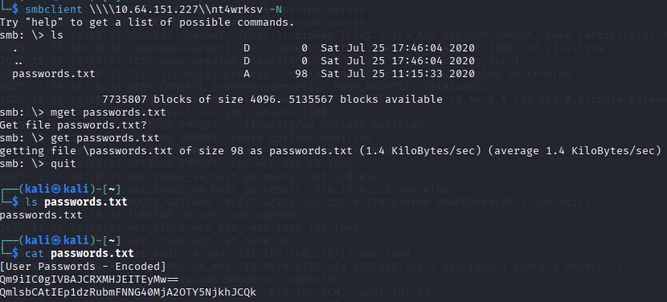

We download that file and view the content of the file.

It is encode with base64.

Let's decode this.

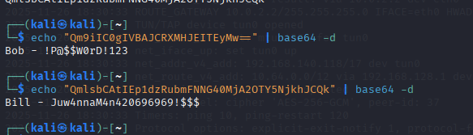

We have two credentials.

Obviously they are not used for ssh.(I tried)

So now we need to figure out what are these credentials used for.

We start with fuzzing the directory, I choose to fuzz the target with port 49663 first.

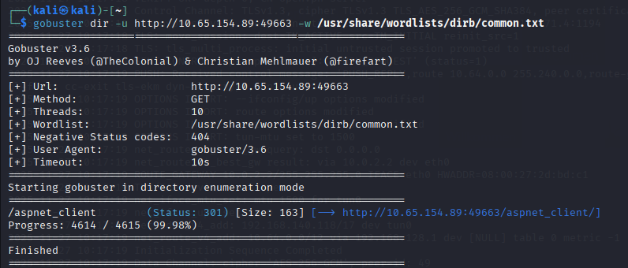

We now know that the target may accept aspx file.

Let's generate a aspx payload.

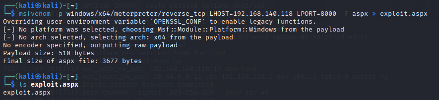

We can try to use the smbclient to upload this payload.

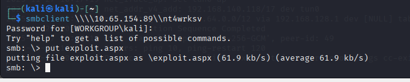

So how to trigger it?

I started with a msf handler

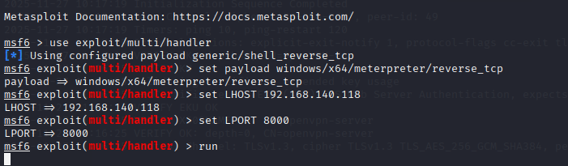

Now let's trigger the payload.

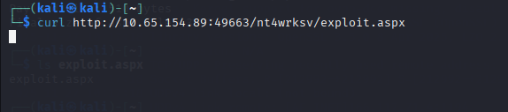

We use curl to trigger it.

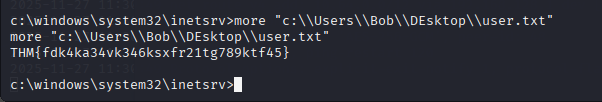

After we into the target, we capture the user.txt flag.

#Post exploition

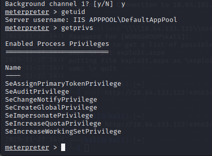

With using getprivs, we find that the current user has the privilege to impersonate privilege.

Our path to escalation privilege is clear now. 

Our escalation privilege path is using printspoofer.exe to proceed.

#Escalation privilege

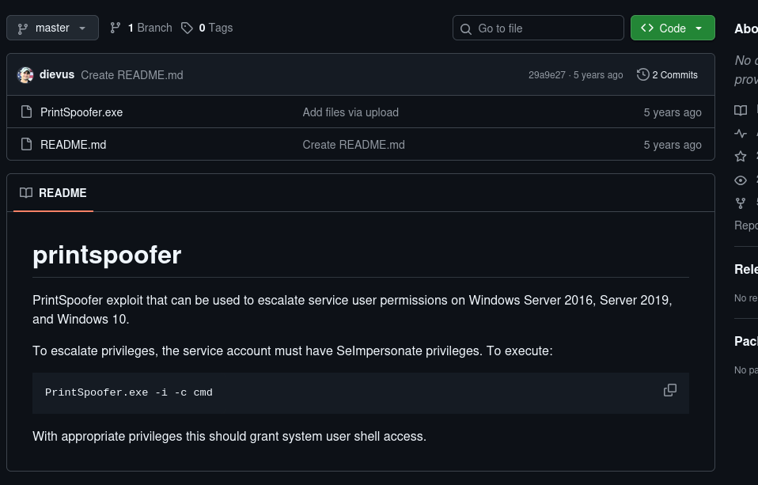

Download the raw file and using smbclient to upload the file into the target.

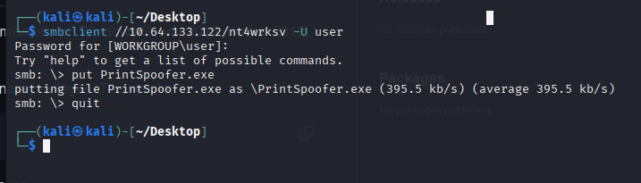

Then we need to trigger it.

Open a shell to proceed.

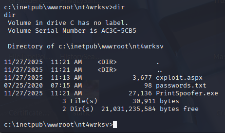

At target directory, we find the file. Now run it.

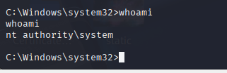

Now we are root.

#Conclusion

To be honest, there may be still some else path to escalation privilege. For example, the credentials we find in password.txt through smbclient. But the way we are using definitely is the most straightforward.

Thanks for reading!
